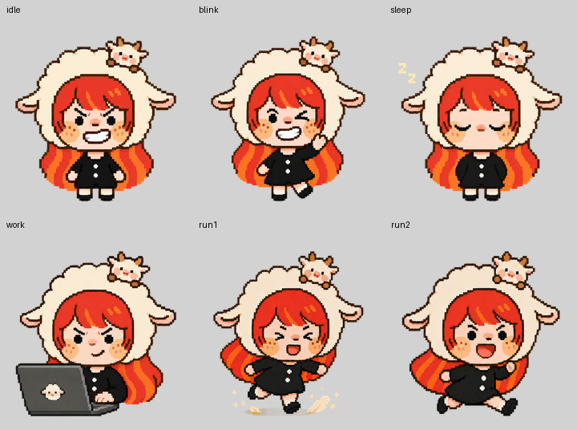
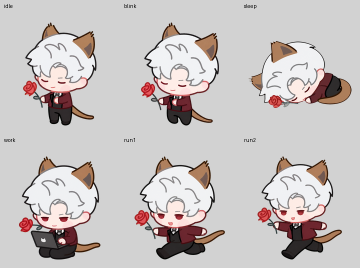
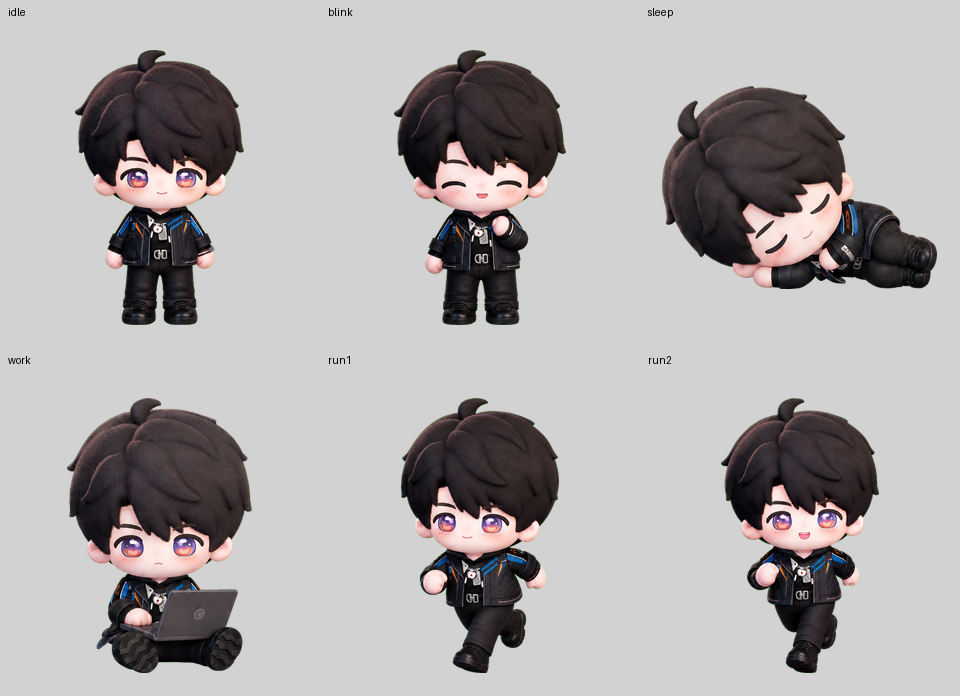

# &#26700;&#23456;&#26500;&#24314;&#22120;

&#19968;&#20010;&#21487;&#22797;&#29992;&#30340; Codex &#26700;&#23456; Skill&#65306;&#20174;&#35282;&#33394;&#21442;&#32771;&#22270;&#25110;&#21160;&#20316;&#32032;&#26448;&#29983;&#25104;&#36879;&#26126;&#26700;&#23456;&#65292;&#24182;&#21487;&#25171;&#21253;&#20026; Codex &#33258;&#23450;&#20041;&#26700;&#23456;&#25110; Windows &#26700;&#23456;&#12290;

## &#25928;&#26524;&#23637;&#31034;

&#19979;&#26041;&#23637;&#31034;&#21516;&#19968;&#35282;&#33394;&#30340;&#24453;&#26426;&#12289;&#30504;&#30524;&#12289;&#30561;&#35273;&#12289;&#24037;&#20316;&#19982;&#20004;&#24103;&#36305;&#21160;&#21160;&#20316;&#12290;&#36305;&#21160;&#20004;&#24103;&#22987;&#32456;&#20445;&#25345;&#21516;&#19968;&#36731;&#24494;&#20391;&#38754;&#26397;&#21521;&#65292;&#20165;&#33258;&#28982;&#20132;&#26367;&#25670;&#21160;&#25163;&#33050;&#12290;

### &#22825;&#25165;&#32874;&#26126;&#32650; - &#20687;&#32032;&#39118;



### &#23567;&#24443; - &#25554;&#30011;&#39118;&#26684;



### &#23567;&#26172; - 3D&#39118;&#26684;



## &#21151;&#33021;&#35828;&#26126;

- &#29983;&#25104;&#24182;&#26657;&#39564;&#20845;&#31181;&#26631;&#20934;&#29366;&#24577;&#65306;&#24453;&#26426;&#12289;&#30504;&#30524;&#12289;&#30561;&#35273;&#12289;&#24037;&#20316;&#12289;&#21521;&#24038;&#36305;&#21160;&#21644;&#21521;&#21491;&#36305;&#21160;&#12290;
- &#25171;&#21253; Codex &#33258;&#23450;&#20041;&#26700;&#23456;&#65306;&#29983;&#25104; `pet.json` &#21644; `spritesheet.webp`&#12290;
- &#29983;&#25104;&#36879;&#26126;&#12289;&#32622;&#39030;&#12289;&#21487;&#25302;&#25341;&#30340; Windows &#26700;&#23456;&#12290;
- &#36305;&#21160;&#20004;&#24103;&#20445;&#25345;&#30456;&#21516;&#30340;&#36731;&#24494;&#20391;&#38754;&#26397;&#21521;&#65292;&#21482;&#20132;&#26367;&#25670;&#21160;&#25163;&#33050;&#65292;&#36991;&#20813;&#24038;&#21491;&#20081;&#26179;&#12290;
- &#26657;&#39564;&#24038;&#21491;&#25302;&#25341;&#19982;&#36305;&#21160;&#26397;&#21521;&#30340;&#26144;&#23556;&#65292;&#36991;&#20813;&#26041;&#21521;&#21453;&#36716;&#12290;

## &#20351;&#29992;&#26041;&#27861;

&#23558;&#26412;&#30446;&#24405;&#25918;&#20837; Codex skills &#30446;&#24405;&#21518;&#65292;&#20351;&#29992; `$desktop-pet-builder` &#35843;&#29992;&#12290;

&#26500;&#24314; Codex &#26700;&#23456;&#65306;

```powershell
python scripts/build_codex_pet.py `
  --source-dir "path/to/pet-images" `
  --id "my-pet" `
  --display-name "my-pet" `
  --run-facing left `
  --drag-loop 12
```

&#26500;&#24314; Windows &#26700;&#23456;&#65306;

```powershell
python scripts/create_windows_desktop_pet.py `
  --source-dir "path/to/pet-images" `
  --output-dir "output/my-pet"
```

## &#20844;&#24320;&#29256;&#35828;&#26126;

&#26412;&#20179;&#24211;&#24050;&#21435;&#38500;&#20010;&#20154;&#35282;&#33394;&#21407;&#22270;&#12289;&#36134;&#21495;&#20449;&#24687;&#12289;&#20973;&#25454;&#12289;&#20196;&#29260;&#12289;&#26412;&#26426;&#36335;&#24452;&#12289;&#29983;&#25104;&#32531;&#23384;&#21644;&#20020;&#26102;&#21457;&#24067;&#25991;&#20214;&#12290;

## &#24320;&#28304;&#21327;&#35758;

MIT&#12290;&#35814;&#35265; [LICENSE](LICENSE)&#12290;
